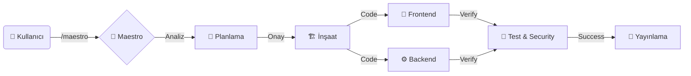

# 🎻 MAESTRO ORCHESTRATOR
> **Antigravity AI Intelligent Orchestration System**

  

---

## 🇹🇷 Hoş Geldiniz / Welcome 🇬🇧

**[TR]** Maestro, yapay zeka yeteneklerini (skills) bir orkestra şefi gibi yöneten, karmaşık projeleri **planlayan**, **inşa eden** ve **yöneten** akıllı sistemdir. Siz sadece ne istediğinizi söylersiniz, Maestro ekibi yönetir.

**[EN]** Maestro is an intelligent system that orchestrates AI skills like a conductor, **planning**, **building**, and **managing** complex projects. You simply state what you need, and Maestro manages the team.

---

## 🚀 Hızlı Başlangıç / Quick Start

| Komut / Command | Açıklama (TR) | Description (EN) |
| :--- | :--- | :--- |
| `/maestro` | **Orkestrayı Başlat.** Sizi dinler ve en uygun planı yapar. | **Start the Orchestra.** Listens to you and creates the best plan. |
| `/plan` | **Sadece Planlama.** Kod yazmaz, detaylı görev listesi (`task.md`) çıkarır. | **Planning Only.** No coding, creates a detailed task list (`task.md`). |
| `/deploy` | **Canlıya Al.** Testleri çalıştırır ve projeyi yayına hazırlar. | **Deploy.** Runs tests and prepares the project for release. |

---

## 🧠 Nasıl Çalışır? / How It Works?

---

## 🛠️ Yetenek Orkestrası / Skill Orchestra

Maestro, aşağıdaki uzman ajanları sizin için yönetir:

### 🏗️ Çekirdek Ekip (Core Team)
| 🛡 Badge | Rol | Görev |
| :--- | :--- | :--- |
| `app-builder` | **Müteahhit** | Proje iskeletini kurar ve teknolojileri seçer. |
| `project-planner` | **Stratejist** | Karmaşık işleri yönetilebilir görevlere böler. |
| `frontend-design` | **Sanatçı** | Modern, estetik ve kullanıcı dostu arayüzler tasarlar. |
| `backend-specialist` | **Mühendis** | Sağlam API'lar, veritabanları ve sunucu yapıları kurar. |

### 🛡️ Kalite & Güvenlik (Quality & Security)
| 🛡 Badge | Rol | Görev |
| :--- | :--- | :--- |
| `webapp-testing` | **Denetmen** | Uygulamayı bir kullanıcı gibi kullanır ve test eder. |
| `vulnerability-scanner` | **Muhafız** | Güvenlik açıklarını tarar ve sistemi korur. |
| `ci-cd-pipeline` | **Otomasyon** | Test ve yayın süreçlerini otomatiğe bağlar. |

---

## 💡 Örnek Kullanım / Example Usage

**Sen / You:**
> *"Bana Next.js ve Tailwind kullanarak modern bir blog sitesi kur. Admin paneli olsun ve sistemi test et."*
>
> *"Build a modern blog site using Next.js and Tailwind. Include an admin panel and test the system."*

**Maestro:**
1.  **Analiz:** Proje türünü (Web App) belirler.
2.  **Ekip:** `app-builder` + `frontend-design` + `backend-specialist` + `webapp-testing` seçer.
3.  **Plan:** Adım adım kurulum planını sunar.
4.  **İcra:** Onayınızla birlikte kodlamaya başlar.

---

> **Antigravity AI** tarafından güçlendirilmiştir.
